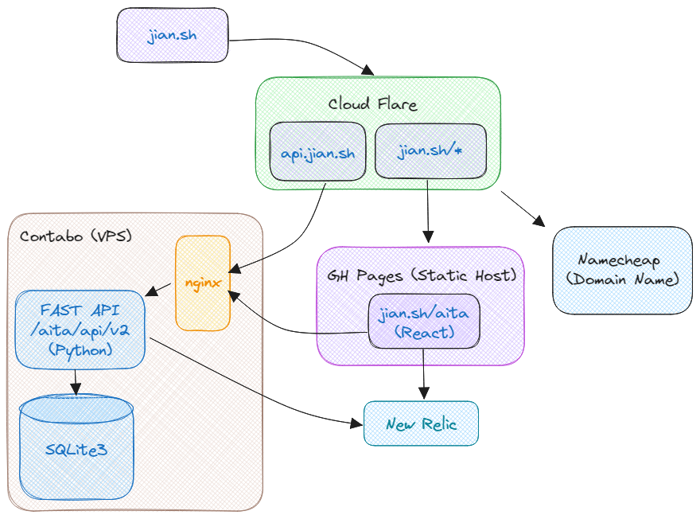

# AITA API

This repository is a complete rewrite of reddit-store using FastAPI

## Swagger Documentation

Swagger documentation can be found at https://api.jian.sh/aita/docs

## Environment



## Run instructions

Create a .env file and provide the following API keys.

```yaml
REDDIT_CLIENT_ID=example
REDDIT_CLIENT_SECRET=example
SUBREDDIT_NAME=AmItheAsshole
POST_LIMIT=5
DATABASE_NAME=AmItheAsshole.db
OPENAI_API_KEY=example
```

Then run it via docker compose with

``docker compose up --build``


## WAL mode

```
sqlite3 github.db 'PRAGMA journal_mode=WAL;'
```